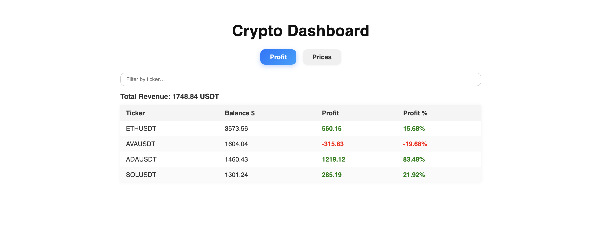

# Crypto Dashboard

A simple crypto dashboard for tracking **profit** and **current prices** of your assets.

## Usage

- Run the frontend application to see the dashboard.
- Switch between Profit and Prices tabs.
- Use the search input to filter assets by ticker.

## Setup
1. Add the `.json` file with your stock data:

   Place the file at:

```
./internal/adapter/stock_data/stock-data.json
```

The file should follow this format:

```json
[
  {
    "ticker": "ETHUSDT",      // ticker
    "average_price": 3490.02, // avg price in your wallet
    "balance": 0.88518373     // balance in your wallet
  },
  {
    "ticker": "AVAUSDT",
    "average_price": 0.6129,
    "balance": 3258.251232
  },
  {
    "ticker": "SOLUSDT",
    "average_price": 168.18,
    "balance": 6.346276
  },
  {
    "ticker": "ADAUSDT",
    "average_price": 0.4297,
    "balance": 1852.4
  }
]
```
## Example
 
